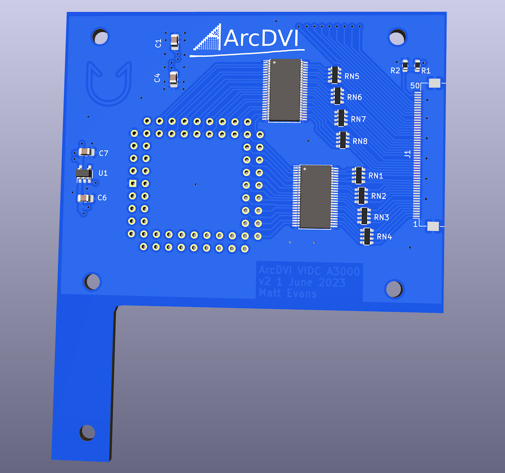

# ArcDVI VIDC push-on PCB

Kicad 6.0 PCB design for the ArcDVI soldered-VIDC push-on board:

This board carries an upturned PTH PLCC68 which plugs onto a soldered VIDC from above.  This should fit an Acorn A3000, but hasn't been mechanically tested with the other soldered-VIDC machine, A5000.  The board exports the buffered signals over FFC to the ArcDVI main PCB.  Mechanically, the main PCB is designed to bolt on top of this board (with appropriate spacers) and fit underneath the floppy drive.

See <https://stardot.org.uk> for more info.

# License

ArcDVI is copyright 2023 Matt Evans.

This work is licensed under the Creative Commons Attribution-NonCommercial-ShareAlike 3.0 Unported License. To view a copy of this license, visit http://creativecommons.org/licenses/by-nc-sa/3.0/ or send a letter to Creative Commons, PO Box 1866, Mountain View, CA 94042, USA.
